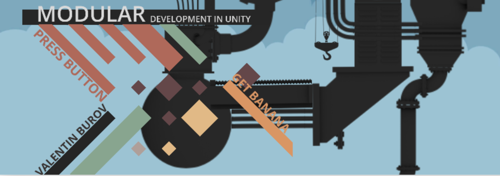

# Press Button, Get Banana
A somewhat loosely coupled talk on Dependency Injection


# Lesson:
The talk is located on [**the VirtualityRipple YouTube Channel**](https://www.youtube.com/playlist?list=PLGKDmLYR31_jdHwaik46p2K5GMTUhv5GA).

# Important: Requires Zenject as submodule
As soon as you clone the repo, init and update submodule with git command:
```
cd PressButtonGetBanana
git submodule init
git submodule update
```

This will add [Zenject](https://github.com/modesttree/Zenject) under the root folder.


Run a copy command (or copy the folder manually):

```
cp -r Zenject/UnityProject/Assets/Plugins/Zenject Assets
```
